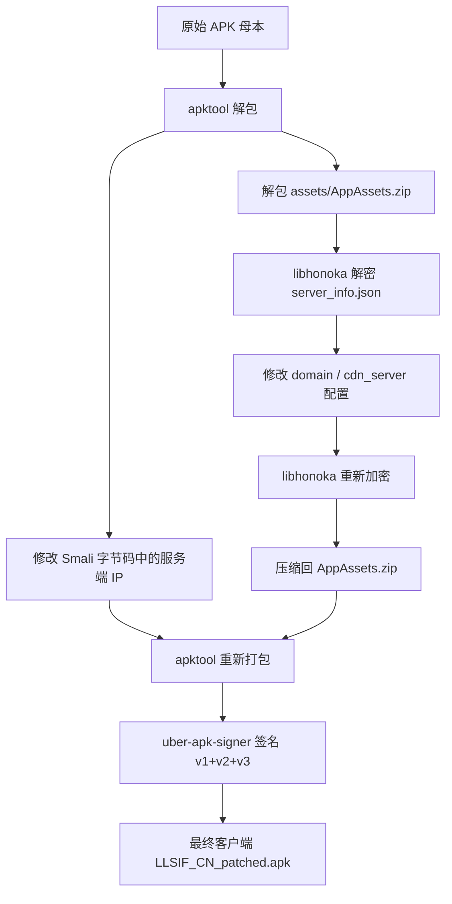

> **项目备忘录**
> - **记录时间**：2026-09-24
> - **访问域名**：<https://sif.shiro.team>
> - **搭建者**：白咲雫

---

# 一、最初的念头

「能复活停服的游戏吗，开个个人私服玩？」

事情的起因很简单，选定了国服已经停服的经典音游 —— **LLSIF1（Love Live! 学园偶像祭）**。

随着折腾的深入，目标逐步收窄并明确：
1. **走公网**：不再局限于本地内网单机自嗨，随时随地在手机上掏出来就能连上开打；
2. **可用私服**：产出真正长期可用、功能闭环的私服，而不是“仅在控制台跑起来不报错”的半拉子玩具。

---

# 二、技术选型：两次推倒重来

在真正跑通之前，先后经历了两轮推倒重来：

| 方案 | 结果 | 说明 |
| :--- | :---: | :--- |
| **NPPS4** | ❌ 弃用 | 依赖与配置链繁琐，历史包袱重，适配国服协议阻力较大 |
| **LoveArrow** | ❌ 弃用 | 遇到兼容性死胡同，维护成本过高 |
| **honoka-chan** (YumeMichi) | ✅ 最终方案 | 基于 Go + Gin + xorm + SQLite，单二进制运行，性能轻量直接 |

> [!NOTE] 关键转折点
> 连续踩坑后，我放弃了完全从零盲目摸索的路线，决定直接参考 B站 UP 主「**梦路_YumeMichi**」分享的实战文稿：《【文稿】LLSIF1 国服私服（本地服）搭建教程.txt》。

---

# 三、数据是怎么搞下来的（最折腾的一段）

游戏服务端程序只是骨架，卡面数据、歌曲音频和 Live 谱面才是血肉。所有资源均来自 UP 主分享的 123 网盘链接 —— 而 **123 网盘的严格风控与限速**，成为了本次折腾中最大的拦路虎。

## 1. 踩坑与破解记录

| 报错现象 / 状态码          | 根本原因                    | 破解尝试与结果                                                       |
| :------------------ | :---------------------- | :------------------------------------------------------------ |
| **5112** 分享方提取流量包不足 | UP 主原始分享链接的下载流量被彻底耗尽    | 转存到自己的 123 网盘账号中下载                                            |
| **5113** 本月免费流量不足   | 个人免费额度用尽，触发针对单文件体积的风控拦截 | 尝试改文件 Size、换客户端指纹、换解析端点、挂不同代理、修改 `web-pro2` 接口 —— **全部以失败告终** |
| —                   | 终极解法                    | 7块开通连续包月低价vip后取消自动续费                                          |

> [!CAUTION] 血泪结论
> 面对这类商业网盘的云端风控规则，所有试图通过技术手段绕过限速和流量计费的折腾基本上都是浪费时间，**充钱才是最快、也是唯一的正解（要不就闲鱼买个日vip）**。

## 2. 最终拿到的数据成果

```text
list_CN_Android.zip     15.16 GB    共 9243 个 zip 包
```

中途在多线程分块下载时还踩了 `parget` 工具的一个坑：在重试断点续传时，程序未重新计算 `start offset`，导致莫名多下了 190 MB 垃圾数据。排查修掉该逻辑后，只对损坏的 `part04` 进行了重下，最终完成了 **CRC 校验 9243 / 9243 全部通过**。

---

# 四、客户端改造与逆向

想要让原版游戏客户端连上我们的私服，必须对 APK 进行逆向打补丁。

- **原始母本**：`LoveLive_9.7.1_patched.apk`（体积 126.7 MB，作为纯净母本永久归档，切勿覆盖或删除）。

## 改造流程



1. **反编译解包**：使用 `apktool` 解包 APK 安装包；
2. **Smali 补丁**：定位并修改 Smali 代码中写死的原厂服务器 IP 与握手地址；
3. **修改核心配置文件**：
   - 目标文件位于 `assets/AppAssets.zip` 内的 `config/server_info.json`；
   - **注意**：该文件是高强度加密的二进制格式，必须借助 `libhonoka` 提供的专用解密/加密模块处理；
   - **踩坑点**：Emscripten 编译出的模块必须通过 `waitReady()` 循环轮询 `M.calledRun` 完成运行时加载，且 Emscripten FS 内部文件路径必须使用**相对路径**，否则加解密直接落空崩溃；
4. **重打包与重签名**：使用 `apktool b` 重新构建 APK，并使用 `uber-apk-signer` 完成 `v1 + v2 + v3` 全版本签名对齐。

---

# 五、服务器搭建与架构

服务端选用 `honoka-chan`，整体采用 Go 单二进制文件配合 SQLite 数据库驱动。架构核心主要包含以下几个部分：

- **核心数据存储**：卡库数据库（`main.db`）收录全量卡牌数据，用户数据库（`data.db`）持久化玩家账号与游戏进度；
- **配置与运营数据**：核心配置文件 `config.json` 与游戏内运营公告、活动配置；
- **静态资源分发**：维护原始压缩包目录与客户端解压资源目录，同时存放供玩家下载的打补丁客户端。

## 服务保障与底层优化

- **守护进程**：编写 `systemd` unit 文件托管 `honoka-chan`，支持挂掉自启、开机加载与平滑重载；
- **TCP BBR 拥塞控制**：由于服务器部署在海外（中美跨洋链路），丢包率和延迟相对敏感。在 Linux 内核开启 **BBR** 算法，实测为长链路资源下载提供了关键的吞吐优化。

---

# 六、域名、HTTPS 与反向代理

为了支持 HTTPS 并隐藏后端端口，整体流量经过反向代理处理：

1. **DNS 解析**：`sif.shiro.team` 配置 A 记录指向 VPS（Cloudflare DNS，灰云直连模式）；
2. **证书签发**：申请 Let's Encrypt ECC 证书，配合 `acme.sh` webroot 模式配置每月自动续期；
3. **网关反代**：使用 1Panel 部署的 OpenResty 进行反向代理。

> [!WARNING] Nginx / OpenResty 指令踩坑
> 机器上的 OpenResty 版本为 1.21，不支持高版本 Nginx 的独立指令 `http2 on;`，强行添加会导致配置校验报错。必须采用兼容旧语法的写法：
> ```nginx
> listen 443 ssl http2;
> ```

---

# 七、配套 Web 站与管理面板

部署在 `https://sif.shiro.team` 域名下的轻量 Web 前端，提供了三大核心能力：

| 路由路径 | 功能定位 | 说明 |
| :--- | :--- | :--- |
| `/cards` | **全图鉴查卡** | 收录 3963 张完整卡牌，支持关键词检索、稀有度筛选与属性筛选 |
| `/me` | **个人中心** | 玩家自助管理账号，支持修改密码、绑定资料（仅限查看与修改本人账号） |
| `/download` | **客户端分发** | 一键下载最新打补丁的 Android 客户端 |

此外，还集成了后台管理面板 `/admin`，受白名单严格保护，可供管理员调整账号资产、发放社员卡牌、审计系统日志等。

---

# 八、事故与修复复盘（血泪教训）

搭建与调试期间经历了大大小小 5 次重大故障，以下按发生顺序进行排查复盘：

## 事故 1：玩家卡在「通信中 / 下载失败」

- **故障现象**：客户端首次登录时，界面长时间转圈，随后弹出通信失败，无法获取资源列表。
- **排查根因**：源码中的 `ForceAllUsersRelogin()` 函数在每次服务启动时，都会无条件对全局所有账号打上 `force_relogin = 1`。中间件 `common.go:73` 检测到该标志后，直接拦截并将所有 `main.php/*` 请求**返回 404**，导致客户端完全拿不到下载清单。
- **修复方案**：将强制重登改为仅在真正发生破坏性数据结构迁移时触发；对已受影响的账号执行：
  ```sql
  UPDATE user_pref SET force_relogin = 0;
  ```
- **技术教训**：**在服务端启动流程中，任何「无条件全局执行」的迁移或重置代码都是定时炸弹。**

---

## 事故 2：卡面与角色立绘全部 404

- **故障现象**：玩家成功进入游戏后，卡面立绘、按钮图标大面积白板，服务端日志中客户端连打 86 次 `/static/Android/extracted/...` 全部返回 404。
- **排查根因**：原教程文稿中特别强调过「除了 `archives` 压缩包，还需要另外维护一份解压后的静态资源目录」。初始搭建时疏忽了这句，导致服务器根本不存在 `extracted/` 目录。
- **修复方案**：编写自动化脚本，将 9243 个 zip 包全量解压到 `extracted/` 目录，生成 **221,846 个文件 / 占盘 11.3 GB**。
- **次生灾害**：首次解压完成后，惊现 **5129 个文件大小变成了 0 字节**！
  - 深度排查发现：资源包中 `type 99` 是增量更新包，里面包含 5245 个 0 字节的占位条目；
  - 解压时文件名按自然序排列，`type 99` 排在最后解压，把前面 `type 0~6` 解压出来的真实非空资源全部覆盖成了空文件；
  - 增加「跳过 0 字节条目」解压过滤规则后重新解压，0 字节异常文件彻底归零。

---

## 事故 3：开启 gzip 压缩导致客户端「发生连接错误」

- **故障现象**：为了优化全卡牌列表（单次响应高达 1.8 MB）的传输速度，在 Gin 路由层挂载了 gzip 压缩中间件。上线后，玩家在点击进入“社员”页面时瞬间报错闪退。
- **排查过程**：编写了针对中间件的独立单元测试，压测验证流完整性与 Content-Length，确认后端中间件逻辑完全符合 HTTP 标准规范。
- **真相大白**：抓取服务端原始报文日志发现：
  ```text
  21:16:49  [AE] 客户端 Accept-Encoding = "gzip,deflate"
  ```
  客户端的 HTTP 网络库虽然在 Header 里大张旗鼓地声明了支持 gzip，但在接收到经过 gzip 压缩的二进制流后，**游戏原生引擎底层根本没有做解压处理**，直接拿压缩乱码去解析 JSON，进而导致反序列化崩溃！
- **处置方案**：在配置文件中果断关闭 gzip：
  ```json
  "gzip_enabled": false
  ```
- **技术教训**：**客户端「声明支持」≠「真能支持」。服务端按规范行事的老实人最容易吃大亏。**

---

## 事故 4：试图用 Cloudflare 边缘加速游戏 API —— 弄巧成拙的负优化

- **设想方案**：游戏 API 每次请求耗时约 1 秒左右（因为客户端每次调用都新建连接，跨洋 TCP 握手 + TLS 协商要跑 3 个 RTT）。设想将 API 域名挂载到 Cloudflare，利用 Anycast 节点就近完成 TCP 握手，预期将握手延迟压缩至 ~310ms。
- **实施操作**：修改客户端 `server_info.json`，把 API 域名指向开启橙云（Proxy）的 CF 域名。
- **实际结果**：**不仅延迟没有降低，反而变得更慢，且频繁发生随机丢包与断连。**
- **处置方案**：全面回退所有改动，`cdn_server` 彻底切回 VPS 直连 IP。
- **结论定性**：海外廉价 VPS 环境下，**Cloudflare 仅适用于 Web 网页展示与静态大文件下载；用于加速游戏协议 API 属于纯粹的负优化**，永久移出备选池。

---

## 事故 5：模板手滑导致服务端直接 panic 瘫痪

- **故障现象**：在修改 `css.html` 前端模板时，错误地使用了文本替换：
  ```javascript
  s.replace('{{ end }}', ...)
  ```
  把 Go 模板语法闭合标签 `{{ end }}` 意外删掉了。服务重启时直接抛出恐慌：
  ```text
  panic: template: css.html:187: unexpected EOF
  ```
  服务端直接挂死，全站访问 502。
- **修复方案**：补齐模板末尾闭合标签。
- **长效防范**：Go 模板 `static/templates/**` 是在程序启动时一次性载入内存编译的，任何语法错误都会导致进程直接起不来。为此在自动化部署链路中增加了**离线模板预检脚本**：每次更新代码前，先用 `html/template` 对全部 19 个模板进行离线语法 Parse，只有 19/19 全部通过后才允许执行 `systemctl restart`。

---

# 九、被误解的上游功能与教训

在适配后台移动端时，曾发生过一次由于“未读全源码”导致的南辕北辙：

- **误判**：用手机打开管理后台时觉得抽屉菜单打不开，以为原作者完全没做移动端适配，于是自作主张给抽屉按钮换了个自定义 ID，并手写了一整套通过 CSS `left` 偏移控制滑出的样式。
- **真相**：事实上，原作者早就完整实现了移动端抽屉！在 `side.html` 中已经预埋了监听器：
  ```javascript
  // 监听原生事件
  [lay-header-event="menuLeft"]
  // 切换类名配合 CSS transform 实现顺滑抽屉与遮罩
  body.admin-side-open  <-->  transform: translateX(-100%)
  ```
- **后果**：我自以为是的改动直接改掉了按钮的选择器，**亲手把原作者做好的原生抽屉逻辑搞报废了**。
- **修正**：果断回退所有冲突代码，只保留正向改进（如针对宽表格的 `overflow-x: auto` 横向滑动优化、字体排版微调）。

> [!TIP] 避坑警示
> 改动别人已有代码前，务必**通读整套上下游调用链**。「看起来没有的功能」，往往只是自己还没找对位置。

---

# 十、功能演进与定制增强

在稳定运行的基础上，针对运营与游玩体验做了大量打磨，全部功能均已稳定落地：

| 模块        | 改进项        | 具体实现与说明                                                      |
| :-------- | :--------- | :----------------------------------------------------------- |
| **系统公告**  | 动态热更新      | 从原版 Go 源码硬编码公告，重构为读取外部 `announce.txt` 文件，修改即时生效无需重启          |
| **合规与版权** | 免责声明公示     | 页面显著标注：非官方私人服、不收取任何费用、版权完全归属原版权方、接权利方通知即刻关停                  |
| **权限控制**  | 动态管理员管理    | Web 界面支持增删管理员账号并热写回 `config.json`；附带防自锁机制与防空白名单拦截            |
| **审计追踪**  | 管理员操作日志    | 建立 `admin_log` 数据表，记录金币/爱心修改、发卡、删卡、权限变动等行为，支持分页与检索           |
| **前后台协同** | 快捷入口联动     | 当登录账号命中管理员白名单时，前台顶部导航栏自动渲染「⚙ 后台管理」快捷通道                       |
| **认证统一**  | 登录入口整合     | 访问 `/admin/login` 自动 `302` 重定向至 `/me/login`，鉴权完成后按角色身份自动分流路由 |
| **移动端优化** | 响应式布局优化    | 补齐宽表格横向自适应滑动与移动端表单自适应，保持上游抽屉交互纯净                             |
| **玩家自助**  | 个人资料修改     | 玩家可自主设置游戏内生日与邀请码，具备参数校验与局部提交保护（防止未填字段被覆盖置空）                  |
| **国内加速**  | CDN 边缘缓存分发 | 网页静态资源接入 Cloudflare 边缘缓存，实测二次请求命中 `cf-cache-status: HIT`     |
| **查询优化**  | 数据库持久索引    | 针对卡库补全 6 个核心查询索引，卡片列表 SQL 检索耗时从 **41.7ms 压至 25ms**           |
| **客户端维护** | 协议热更通道     | 改造 `download/update` 接口，每次下发 1.1KB 轻量覆盖包；后端切换域名或配置无需重新打包 APK |

---

# 十一、做了但结论是「不要做」的避坑总结

这些自己尝试踩到的坑，防止以后脑子一热重新试一遍：

| 尝试的方案 | 最终结论 | 放弃原因 |
| :--- | :---: | :--- |
| **游戏 API 走 Cloudflare Proxy** | ❌ **不要做** | 延迟从 ~1s 恶化，伴随随机断连，跨洋协议加速纯属负优化 |
| **开启 gzip 压缩游戏接口响应** | ❌ **不要做** | 客户端底层网络库并不解压，直接导致解析 JSON 崩溃报连接错误 |
| **在网页端直接展示卡面立绘** | ❌ **不要做** | `.texb` 资源文件为高熵值（8.00）加密格式，服务端实时解密成本极高；公开图库又存在防盗链限制 |
| **通过技术脚本绕过 123 网盘限速** | ❌ **不要做** | 云端按单文件做风控校验，各种改 header、换指纹均告失效，买 VIP 是唯一可行解 |
| **用字符串正则粗暴替换修改 HTML 模板** | ❌ **不要做** | 极易丢掉 `{{ end }}` 闭合标记导致 Go 启动 panic，改模板必须经由语法预检 |

---

# 十二、最终运行状态与系统度量

## 资源占用情况

| 系统资源 | 实际占用 | 性能表现评估 |
| :--- | :--- | :--- |
| **内存占用** | ~42 MB | VPS 总内存 3.7 GB，仅占 **1%** 左右，极度轻量 |
| **磁盘存储** | ~27 GB | 游戏素材静态资源占去 26.5 GB |
| **CPU 负载** | 0% ~ 2% | 闲时几乎为 0%，有玩家并发下载素材时波动至 ~2% |
| **网络吞吐** | 3 人并发 88 Mbps | VPS 上行带宽上限为 400 Mbps |

> [!NOTE] 性能定论
> 基于 Go 构建的服务端，**中美跨太平洋的物理信道带宽与延迟，是唯一的性能短板**。

自动化自检跑分：
```bash
python3 selftest_e2e.py
```
测试结果：**10 通过 / 0 失败**，所有链路全绿。

---

# 十三、如果重来一次：六条运维准则

1. **动手前通读指南**：解压资源 `extracted/` 的那次返工纯属看文档不仔细导致的无用功；
2. **动别人代码前先读全**：移动端抽屉越俎代庖的教训深刻，别轻易给成熟项目“擦屁股”；
3. **模板修改必须走离线预检**：Go 的模板语法解析错误会直接带崩整个主进程；
4. **别跟网盘风控死磕**：消耗的排查时间与精力远超那十几块钱的 VIP 会员费；
5. **客户端声明支持什么，千万别全信**：gzip 压缩事故警钟长鸣；
6. **对任何「全局/无条件」的代码逻辑保持敬畏**：启动时清理数据的危险操作绝对不能上线。

---

# 十四、关键信息与常用运维命令备查

## 1. 核心网络与管理配置

```text
服务端口       : 51400（honoka-chan 直连监听）
生产域名       : https://sif.shiro.team（443）
管理后台       : https://sif.shiro.team/admin
玩家个人中心   : https://sif.shiro.team/me/login
客户端下载     : https://sif.shiro.team/download
管理员白名单   : config.json 中的 admin_phones 配置
```

## 2. 常用排障与运维指令

- **重启服务**：
  ```bash
  systemctl restart honoka-chan
  ```
- **端到端健康自检**：
  ```bash
  python3 selftest_e2e.py
  ```
- **慢接口排查日志**：
  ```bash
  grep SLOW-API service.log
  ```
- **抓取客户端声明的编码格式**：
  ```bash
  grep '\[AE\]' service.log
  ```
- **安全重启前连接检查**（避免打断正在下载大型资源包的玩家）：
  ```bash
  ss -tin state established '( sport = :51400 )' | grep -c bbr
  ```

---

折腾完了。这个小小的怀旧角落，就这样在公网稳稳地跑起来了。
原视频：【【教程】LLSIF1 国服私服（本地服）搭建教程】 https://www.bilibili.com/video/BV1Fk4y1S7HA/?share_source=copy_web&vd_source=e703c525c3faf0b743827824b4f80504
感谢UP主 **梦路_YumeMichi** 提供的服务端与资源
