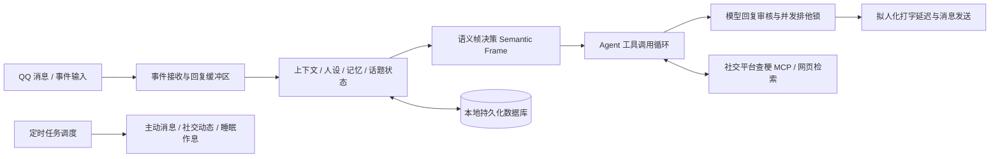

> 在日常用各种 QQ 聊天机器人时，大伙估计都遇到过下面的事：
> - **冷冰冰的“工具人”感**：不 `@` 它的时刻，它就像死了一样，群里聊得再嗨也绝不动弹；`@` 它一下，就干巴巴吐出一堆搜索引擎式的机器回答。
> - **视听体验极度割裂**：群友丢了一张搞笑 GIF、梗图或者小视频，机器人要么一脸懵逼发一串乱码，要么直接装看不见。
> - **永远被动，毫无生活感**：它没有作息，没有偏好，更不会在深夜劝你早点睡觉，或者在日常里主动发一条动态分享它今天的心情。
>
> 为了让 Bot 真正具备一点“人味儿”，我从 2026 年初开始摸索这个插件。我不想做又一个简单的 API 转发器，而是想打造一个**有独立性格、有作息、能看得懂动图、还会主动发空间动态**的“赛博群友”。
>
> 经过长期压力测试 Gemini、Claude 与 GPT，历经多次架构重构，终于做成了这个插件——**`nonebot-plugin-personification`**（中文名：拟人化聊天）。

---

# 运行架构：如何让回复兼具灵动与稳定

在传统聊天 Bot 开发中，大模型慢回复（Slow-reply）是个令人头疼的问题。如果直接把消息往 LLM 塞，并发一高不仅容易插话乱套，遇到网络波动还极其容易重复发消息把群聊弹爆。

为了解决这些硬伤，我在底层设计了一套分层的运行架构：



核心原则非常明确：**把“语气与聊天内容”完全交给大模型自由发挥，而代码负责控制上下文拼装、防重复发送、记忆存储以及并发安全锁**。

这样既保证了机器人的话语足够灵动，又确保了运行上的稳定可靠。

---

# 核心功能

## 1. 全方位多模态（看懂表情包、GIF 与短视频）

普通的聊天 Bot 通常只能处理纯文本和静态图片。为了打破这种视觉割裂，我引入了一套轻量高效的多模态处理逻辑：

- **静态表情包与梗图精准识别**：自动分析图中的文字、人物动作与表情含义，并做出符合人设的自然回应。
- **GIF 动图与短视频关键帧采样**：关于这个我之前专门写过一篇文章[《让 QQ Bot 大致看懂 GIF：我在拟人插件里的一种折中做法》](/posts/qqbot-gif-understanding/)。哪怕使用的是没有原生视频分析能力的通用大模型，插件也会自动把关键帧采样并拼贴为“连环画”长图，让大模型一眼看懂动态过程。
- **动态表情包自动收集库**：Bot 会在日常聊天中偷偷收藏有趣、可复用的表情包，并在后续对话中结合上下文和当前情绪主动扔表情包交流！

## 2. 记忆系统与好感度演进

没有记忆的 Bot 是没有魂的。

- **长期记忆与用户画像**：Bot 会在聊天中自动提取并记录用户的个人偏好（如打什么游戏、平时几点睡觉、喜欢什么动漫等），并在未来的聊天中自然提及。
- **动态好感度系统**：聊天氛围融洽时，Bot 对当前群或个人的好感度会自动上升。好感度提升后，说话语气会变得亲近，调侃和称呼也会发生变化；而遇到恶意骚扰时，它也会表现出防卫与边界感。
- **群聊风格自动适应**：每个群都有自己的气氛，插件会自动学习群聊的语言风格（是热衷吐槽、还是偏向严肃讨论），让 Bot 的融入不显得突兀。

## 3. 拟人化作息与打字细节

为了避免机械感，细节打磨至关重要：

- **独立的睡眠与生活作息**：可以为 Bot 设定睡眠时间与活跃阶段。到了深夜睡眠时间，Bot 会表现出困倦、劝你早点休息，甚至拒绝无休止的深夜连轴转。
- **拟人化打字延迟**：Bot 不会秒回。它会根据回复字数与推理耗时模拟人类打字延迟，支持分段发送、拍一拍、引用回复，甚至偶尔犯一点点无伤大雅的错别字。

## 4. 社交平台联网查梗 (B站/抖音/贴吧/小黑盒)

网络流行语和游戏黑话迭代极快，为了防止 Bot 听不懂最新的网络梗，插件内置了原生的社交平台查梗能力：
- 支持自动在 **B站、抖音、贴吧和小黑盒** 中检索最新的热点与黑话解释。
- 引入了多源校验机制：只有在多个独立来源都认可该黑话解释时，机器人才会将其采纳，防止被网上的虚构段子误导。

## 5. 主动发 QQ 空间与社交互动

Bot 不再是被动等待调用的机器：
- **自主发说说**：遇到有趣的事情或达到特定触发条件时，Bot 会**主动发布 QQ 空间说说/动态**，分享它的第一人称随笔与碎碎念。
- **空间好友互动**：它还会去浏览好友的 QQ 空间动态，主动点赞或在评论区留言互动！
- **防重复发布保证**：底层设计了严苛的发布状态机，哪怕出现网络超时或中断，也绝不会出现盲目重发把好友空间动态弹爆的情况。

---

# 免配置黑盒的可视化 WebUI

考虑到很多朋友不喜欢繁琐的配置文件，插件内置了开箱即用的可视化 WebUI 管理后台（启动 NoneBot 后访问 `http://127.0.0.1:8080/personification/` 即可）。


## 安全私聊验证码登录

后台防爆非常重要。登录时，系统会自动读取超级管理员列表，发起登录请求后，Bot 会在 **QQ 私聊中直接向管理员发送 5 分钟有效的动态验证码**，验证通过后才能进入面板。

拥有 WebUI 之后，`.env` 文件几乎不需要配置繁琐的 API 路由，页面上点点按按就能搞定人设切换和模型调优（当然你配置了 `.env` 也会去自动读取）。

---

# 常用 QQ 指令参考

插件指令支持 `拟人`、`人格` 或 `/persona` 前缀：

### 普通用户可用
- `拟人 帮助`：调出详细命令菜单与使用说明。
- `群好感`：查询当前群聊与 Bot 的好感度得分及关系等级。
- `查看画像`：查看 Bot 为你记录的个人偏好与记忆画像。
- `说 <文本>` / `朗读`：显式让 Bot 进行语音朗读。

### 管理员 / Bot 主可用
- `开启拟人` / `关闭拟人`：开启或关闭当前群的聊天响应。
- `设置人设 <提示词>` / `查看人设`：即时修改或查看当前群的人设。
- `拟人 人设构建 <作品名> <角色名>`：一键提取并构建性格模板。
- `发个说说`：手动触发 Bot 生成并发布一条 QQ 空间说说。
- `拟人 模型 路由`：实时热切换底层使用的 LLM 模型。
- `清除记忆`：清理指定用户或群聊的上下文与记忆。

（当然这些在有了 WebUI 之后就很少用到了）

---

# 快速安装与上手

## 安装命令

```bash
# 使用 NoneBot CLI 安装（推荐）
nb plugin install nonebot-plugin-personification

# 或使用 pip 安装
pip install nonebot-plugin-shiro-personification
```

## 基础配置

在你的 NoneBot2 项目根目录 `.env` 文件中加入：

```env
# 确保加载插件目录
plugin_dirs=["plugin"]

# 开启 WebUI 监听
PERSONIFICATION_WEBUI_HOST=127.0.0.1
PERSONIFICATION_WEBUI_PORT=8080
```

启动 Bot 后，向 Bot 私聊或在群里发送 `拟人 帮助` 即可开始体验！

---

# 总结与开源地址

当然现在还说不上有多完善，毕竟我自身实力在这里，这个插件基本靠 vibe coding 完成，从前期 Trae 到中期 Claude Code，再到现在火力全开的 Codex，有太多太多我想要的还没实现的功能了。

现在插件体积越来越大，我一个人也不能保证各个功能都完善，只能说希望以后越来越完善，Bot 越来越拟人吧！

欢迎大家试用并提出宝贵建议！

- **GitHub 源码**：[luojisama/personification](https://github.com/luojisama/personification)
- **PyPI 包名**：[nonebot-plugin-shiro-personification](https://pypi.org/project/nonebot-plugin-shiro-personification/)
- **开发版**：[luojisama/personification](https://github.com/luojisama/personification)
